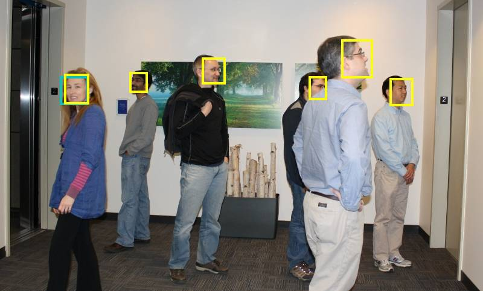
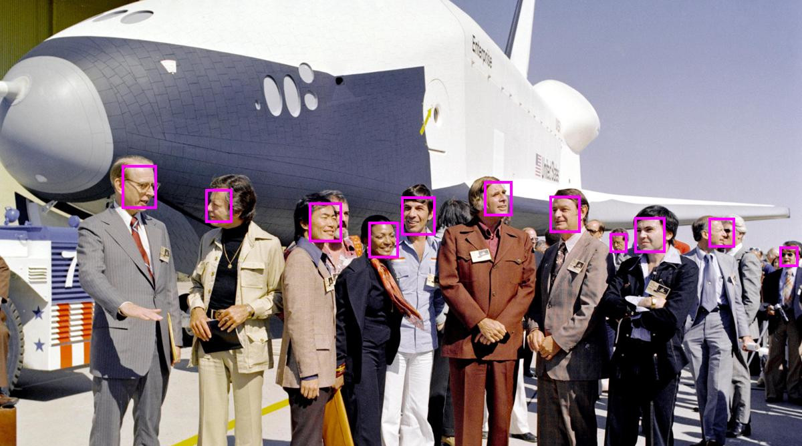
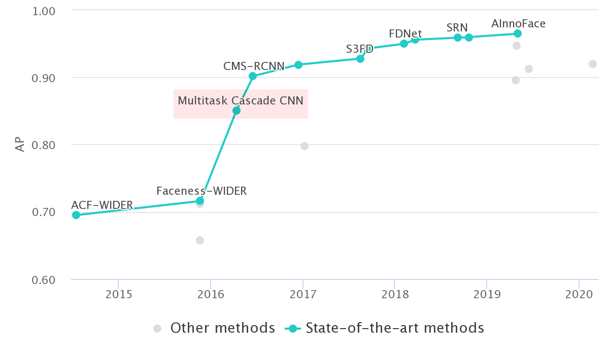

__Get a fast and accurate face and facial feature detector for MATLAB [here](https://github.com/matlab-deep-learning/mtcnn-face-detection/releases)__

<video controls src="pretty-good.mp4"></video>

## Intro

Everyone pretty much takes good quality face detection for granted these days, and it's essentially a solved problem in computer vision. Everyone's photo app can detect all the face you care about and computer vision competition results are increasingly focussing on performance for difficult, small, or occluded faces.

Although MATLAB has a face detector built into the Computer Vision Toolbox I'm sure most who have had some reason to use it have come away disappointed. Honestly, it's pretty outdated as deep learning has totally revolutionised computer vision since that face detector was released.

## Enter MTCNN

There are now tons of deep learning based face detectors, each of them eeking out more and more performance on standard benchmarks. But sometimes you just want something that is pretty good and well tested in real life.

Multi-task Cascaded Convolutional Neural Network (MTCNN) is a little old but has a fairly simple architecture, is small and fast, and performs well. It also has the additional advantage of outputting the locations of facial features (eyes nose and mouth). It's been widely used for a pre-processing step in lots of other applications and it works well and reliably.

## MTCNN in MATLAB

I've ported the [original MTCNN](https://kpzhang93.github.io/MTCNN_face_detection_alignment/) pre-trained weights into MATLAB, using some of the deep learning features introduced in R2019b. (I've also done some work to make sure that it still runs in R2019a, although it's a little slower.)

I've released this as an open source project, the code and toolbox (for simple install) is [available on GitHub](https://github.com/matlab-deep-learning/mtcnn-face-detection)

<video controls src="crowd.mp4"></video>

## Training?

One thing to note is that the current code doesn't support training a new model, although this would be perfectly possible to do. People don't seem particularly interested in training a new model, just using the standard pre-trained weights. If I'm wrong about this and you're desperate to train you own models please [comment on this issue](https://github.com/matlab-deep-learning/mtcnn-face-detection/issues/1) to let me know.
