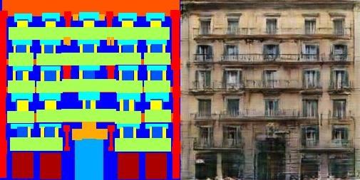

Of all the GAN architectures pix2pix is a personal favourite. It popularised the use of GANs for image to image translation, it's nice and simple, trains relatively quickly, and invariably produces some surprisingly pleasant results. If you don't know what pix2pix is, see the [original project page](https://phillipi.github.io/pix2pix/) which has some nice examples and a demo. Or just [search Twitter for #pix2pix](https://twitter.com/search?q=%23pix2pix) for some fun examples.

Since R2019b MATLAB has had support for automatic differentiation and it's been possible to train GANs. So one of the first things I tried out was writing a MATLAB version of pix2pix (unlike Python it's easy to be the first to write and implementation of a deep learning paper in MATLAB).

The classic example for pix2pix is the facades dataset and running this is gives similar results to the original paper (although training time is quite a lot slower).

I've released this as an open-source [project on GitHub](https://github.com/matlab-deep-learning/pix2pix) if you run into any problem please file an [issue.](https://github.com/matlab-deep-learning/pix2pix/issues)
