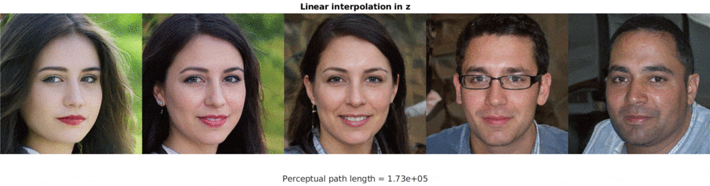

Everyone who's ever seen output from GANs has probably seen faces generated by StyleGAN. Now you can [do the same in MATLAB!](https://github.com/justinpinkney/stylegan-matlab-playground)

<video controls src="circle.mp4" loop="true"></video>

StyleGAN (and it's successor) have had a big impact on the use and application of generative models, particularly among artists. Much of this has been a combination of accessible and (fairly) straightforward to run code, great stability in training, a particularly well formed and editable latent space representations, and ease of transfer learning. It's been taken up very readily by people on twitter and tools like runwayml make it very accessible for non-programmers too. There's also a wealth of [pre-trained models](https://github.com/justinpinkney/awesome-pretrained-stylegan) available, and I maintain my own [collection of them](../pretrained-stylegan).

One thing that makes StyleGAN less appealing is that they're written in TensorFlow. And although they're very performant it makes them much more less accessible to modify and adapt. In fact it's a telling reflection on the differences between deep learning frameworks that many subsequent papers proposing modifications and extensions to StyleGAN have actually chosen to use a PyTorch port rather than the TensorFlow original.

## StyleGAN in MATLAB (yes really)

Since R2019b MATLAB has had support for a low-level interface to deep learning. Rather than dealing with layers, you can write networks as normal functions. This makes it a good deal easier to port things from other frameworks (in particular PyTorch).

So as an exercise in testing out the new features and really getting to grips with the details of StyleGAN, I ported the original to MATLAB. Below is a version of the classic style mixing figure from the original paper (using the original FFHQ model)



To use a pre-trained generator I have a [small bit of Python code](https://github.com/justinpinkney/stylegan-matlab-playground/blob/master/scripts/stylegan_convertor.ipynb) (which you can run freely in Colab without needing any Python setup) which allows you to take a model trained in the original implementation and convert the weights to a .mat file for use in MATLAB. If you're looking for some pre-trained models a good place is [my pretrained StyleGAN model collection](https://github.com/justinpinkney/awesome-pretrained-stylegan).

As well as simply creating faces using the generator it's now very simple to use the rest of the deep learning features in MATLAB. For example you can use one of the pre-trained models to compute a perceptual path length to see the differences in interpolation methods. (Note the original uses a different perceptual loss so the numbers aren't comparable to those in the paper) Interpolation in z space makes some random glasses appear, whereas using w space gives a much smoother transition.

## Hacking the Model

The big advantage (at least for me) of having an implementation in MATLAB, rather than TensorFlow, is that it becomes a lot easier to monkey around with the internals of the model.

Currently there is a system of callbacks so that you can reach into the model and mess around with things like the internal activations. Here's an example where you can modify the learned constant that is at the begning of the model to change the content of the generated image. If you extend it you can create more background (or endless hair), if you set it to some random numbers you get a mish mash of facial features.





And here's another where I'm using just rotating the activations at a particular layer. If you're interested in what can be done with this sort of approach, see the [work by Terence Broad](https://terencebroad.com/research/network-bending) which takes the idea a lot further.

<video controls src="rotate.mp4" loop="true"></video>

## No Training

Unfortunately MATLAB doesn't yet support double differentiation so it's not possible to train a StyleGAN model in MATLAB.

## The Code

The StyleGAN implementation is released as an open-source [project on GitHub](https://github.com/justinpinkney/stylegan-matlab-playground).

The code is currently in a state that it's probably not super comprehensible to someone else (there are a few [example live scripts](https://github.com/justinpinkney/stylegan-matlab-playground#examples) at least). If anyone is actually interested in using this, create an issue or reach out to me [on Twitter](https://twitter.com/buntworthy) and I'll endeavour to get round to making it a bit more useable.

Of course shortly after I'd done all of this Nvidia went ahead and released [StyleGAN2](https://github.com/NVlabs/stylegan2) which redefined the state of the art again!

## And finally

If you want a peek at what things I've used this for I've collected some of my experiments with generated faces is this Twitter thread:

https://www.twitter.com/Buntworthy/status/1275175544087367682