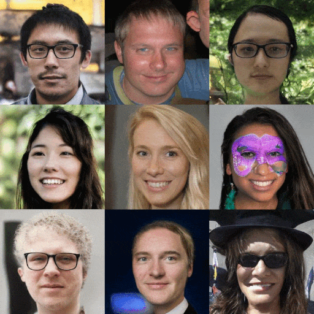

## Making Ukiyo-e portraits real



In my previous post about attempting to create an [ukiyo-e portrait generator](../ukiyoe-yourself) I introduced a concept I called "layer swapping" in order to mix two StyleGAN models[^version]. The aim was to blend a __base model__ and another created from that using transfer learning, the __fine-tuned model__. The method was different to simply interpolating the weights of the two models[^interpolation] as it allows you to control independently which model you got low and high resolution features from; in my example I wanted to get the pose from normal photographs, and the texture/style from ukiyo-e prints[^style-transfer].



The above example worked ok, but after the a [recent Twitter thread](https://twitter.com/AydaoGMan/status/1295876628762046464?s=20) popped up again on model interpolation, I realised that I had missed a really obvious variation on my earlier experiments. Rather than taking the low resolution layers (pose) from normal photos and high res layers (texture) from ukiyo-e I figured it would surely be interesting to try the other way round[^texture].

https://vimeo.com/451284388

It was indeed interesting and deeply weird too! Playing around with the different levels at which the swap occurs gives some control over how realistic the images are. If you've saved a bunch of network snapshots during transfer learning the degree to which the networks have diverged also give some interesting effects.





You also see some wonderfully weird effects because of the fact that ukiyo-e artists almost never drew faces straight on. As the original faces model is mostly straight-on the model has a somewhat tough time adapting to this change.



## Blending other StyleGAN models

You can also swap models which are trained on very different domains (but one still has to be fine-tuned from the other). For example the Frea Buckler model trained by [Derrick Schultz](https://artificial-images.com/). Swapping out the original FFHQ trained model into this one is in a sense replacing the rendering to be of the faces model, but the structure to be from the new one.

https://vimeo.com/451291240

As well as being pretty mesmerising it seems to give some hints as to how the model transferred domains. It looks like it's mostly adapted features corresponding to the background of the original images to serve as the structural elements of the new model. Many of the new images look like an "over the shoulder" view point, and the original faces have been pushed out of frame (although as noticed they are still lurking there [deep in the model](https://youtu.be/s3ZC2rMczt8)). Although you could probably understand these details of the mechansim of domain transfer using some statistical analysis of the network weights and internal activations, this is quite a simple and pretty way of getting an intuition.

## Get the code and blend your own networks

I've shared an initial version of some code to blend two networks in this layer swapping manner (with some interpolation thrown into the mix) in my [StyleGAN2 fork](https://github.com/justinpinkney/stylegan2) (see the blend_models.py file). There's also an [example colab notebook](https://colab.research.google.com/drive/1tputbmA9EaXs9HL9iO21g7xN7jz_Xrko?usp=sharing) to show how to blend some StyleGAN models[^models], in the example I use a small faces model and one I trained on satellite images of the earth above.

I plan to write a more detailed article on some of the effects of different blending strategies and models but for now the rest of this is documenting some of the amazing things others have done with the approach.

## Over to you StyleGAN Twitter!

### Disneyfication

Shortly after sharing my code and approach, some of the wonderful StyleGAN community on Twitter started trying things out. The first really amazing network blend was by Doron Adler, he mixed a model fine-tuned on [just a few images of Disney/Dreamworks/Pixar](https://twitter.com/Buntworthy/status/1297976798236598274) characters to give these uncannily cartoonish characters.

https://www.twitter.com/Norod78/status/1297513475258953728

He also used a StyleGAN encoder to find the latent representation of a real face in the "real face" model then generate an image from the representation using the "blended" model with amazing semi-real cartoonification results:

https://www.twitter.com/Norod78/status/1297849293299212288

I think this approach would make a great way of generating a paired image dataset for training a pix2pixHD model, i.e. the [StyleGAN Distillation approach](https://arxiv.org/abs/2003.03581).

### Resolution dependent interpolation: foxes, ponies, people, and furries

It was originally [Arfa](https://twitter.com/arfafax) who asked me to share some of the layer swapping code I had been working on. He followed up by combining both the weight interpolation and layer swapping ideas, combining a bunch of different models (with some neat visualisations):

https://www.twitter.com/arfafax/status/1297694374470402055

The results are pretty amazing, this sort of __"resolution dependent model interpolation"__ is the logical generalisation of both the interpolation and swapping ideas. It looks like it gives a completely new axis of control over a generative model (assuming you have some fine-tuned models which can be combined). Take these example frames from one of the above videos:



On the left is the output of the __anime model__, on the right the __my little pony model__, and in the middle the mid-resolution layers have been transplanted from __my little pony__ into __anime__. This essentially introduces middle resolution features such as the eyes and nose from __my little pony__ into __anime__ characters!

### Parameter tuning

[Nathan Shipley](https://twitter.com/CitizenPlain) made some beautiful experiments trying to get the [Toonification effect](../toonify-yourself) just right by adjusting two of the key parameters: the amount of transfer learning to apply (measured in thousands of iterations) and the resolution layer from which to swap. By tuning these two you can pick out just the degree of Toonificaiton to apply, see this lovely figure made by Nathan:

 <link rel="stylesheet" href="https://unpkg.com/leaflet@1.9.4/dist/leaflet.css"
     integrity="sha256-p4NxAoJBhIIN+hmNHrzRCf9tD/miZyoHS5obTRR9BMY="
     crossorigin=""/>

 <!-- Make sure you put this AFTER Leaflet's CSS -->
 

 

 

Then he applied First Order Motion model and you get some pretty amazing results:

https://www.twitter.com/CitizenPlain/status/1308824021803372549

## Going further

I think there's lots of potential to look at these blending strategies further, in particular not only interpolating between models dependent on the resolution, but also differently for different channels. If you can identify the subset of neurons which correspond (for example) to the my little pony eyes you could swap those specifically into the anime model, and be able to modify the eyes without affecting other features, such as the nose. Simple clustering of the internal activations has already been shown to be an effective way of identifying neurons which correspond to attributes in the image in the [Editing in Style paper](https://arxiv.org/abs/2004.14367) so this seems pretty straightforward to try!



[^version]: I did all this work using StyleGAN2, but have generally taken to referring to both versions 1 and 2 as StyleGAN, StyleGAN 1 is just config-a in the StyleGAN 2 code.

[^interpolation]: Interpolating two StyleGAN models has been used quite a bit by many on Twitter to mix models for interesting results. And as far as I'm aware the idea first cropped up in generative models in the [ESRGAN paper](https://arxiv.org/abs/1809.00219).

[^style-transfer]: If this sounds a little bit like style-transfer then you're not far off there are some similarities. In face StyleGAN's architecture was inspired by networks designed for style transfer.

[^texture]: It seems to be a general rule that neural networks are better at adding texture than removing it.

[^models]: If you're in search of some models to blend then see collection of [pretrained stylegan](../pretrained-stylegan/) models (I intend to add a field as to which ones have been fine-tuned in the near future.)
