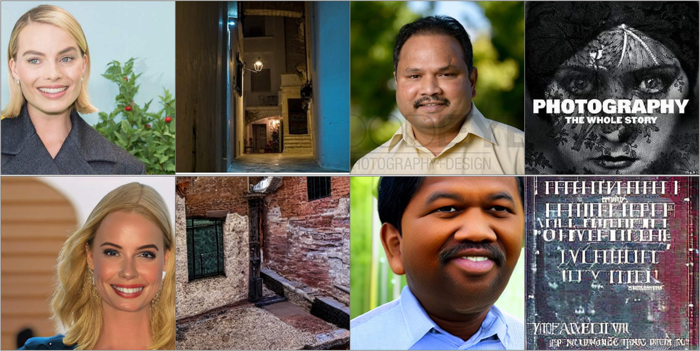
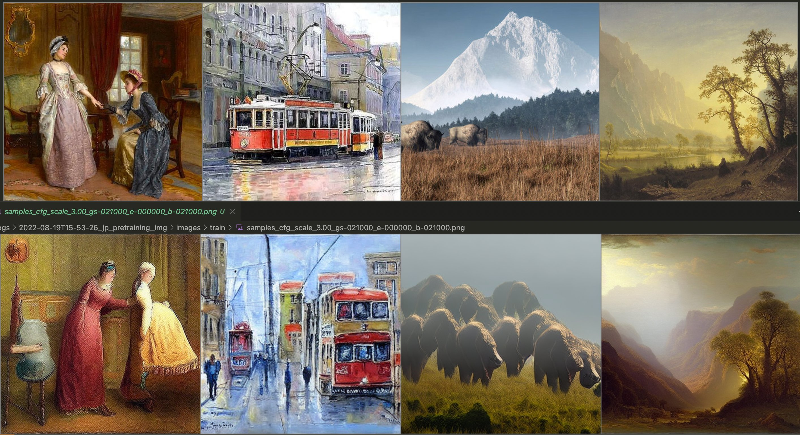
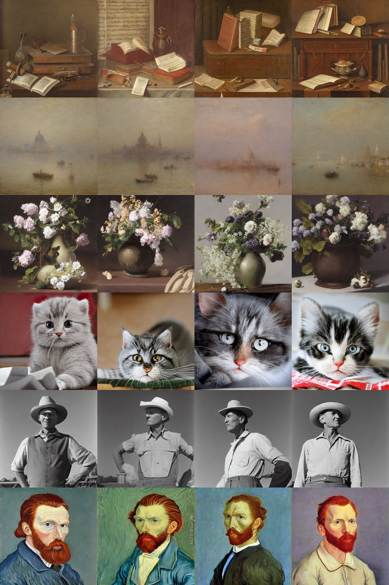
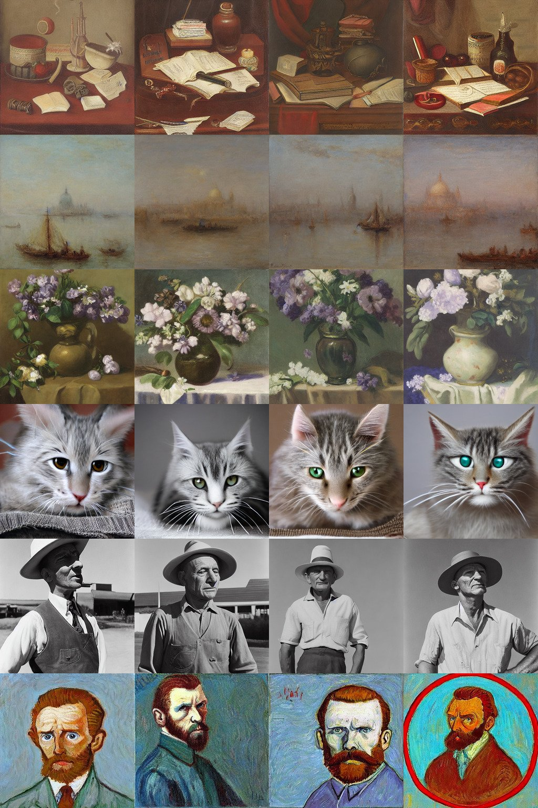
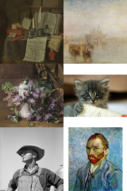
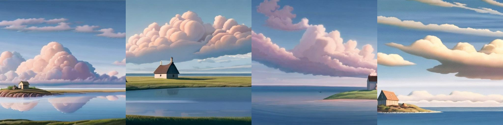
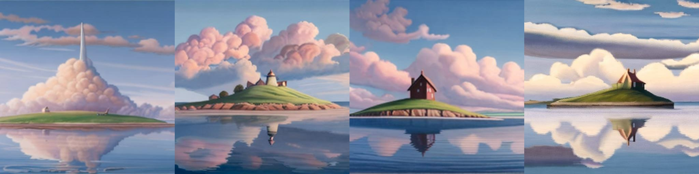

<link rel="stylesheet" href="/photoswipe/photoswipe.css">


.flex-container {
    display: flex;
    flex-wrap: wrap;
}
.flex-container picture {
    width: 50%;
    height: auto;
    padding: 0.1em;
}

.flex-container a {
    flex: 1;
    padding: 0.1em;
}




<link rel="stylesheet" href="/photoswipe/photoswipe.css">


This post is time-travelling a little. For some reason I never blogged about the image variations stable diffusion model I trained, so this is a bit of a recap on the how and why of the image variation model and to collect some links and experiments using it. The model itself is a little old now and there are other models which are similar might be better like [Karlo v1.0](https://github.com/kakaobrain/karlo) and [Kandinsky](https://github.com/ai-forever/Kandinsky-2) (probably not the [Stable Unclip](https://github.com/Stability-AI/stablediffusion/blob/main/doc/UNCLIP.MD) though.). But on [my drive to try and own my content](/blog/2023/the-other-web) and make sure it exists beyond walled gardens like Twitter, here's a post mostly cobbled together from other sources.

As soon as the original stable diffusion was released I wanted to see how I could tweak the model beyond [regular fine tuning](/blog/2023/pokemon-generator). The image variations shown in the original dalle2 paper were always really compelling and this model presented the first chance to actually reproduce those (without lots of training resources). The key part would be to somehow pass images encoded as clip embeddings to the model rather than text embeddings.



Schematic of how the normal Stable Diffusion uses a set of token embeddings from the CLIP text encoder to condition the diffusion model.

Originally I mis-understood the architecture of stable diffusion and assumed that it took the final clip shared latent space text embedding and thought I might just be able to swap this out for an image embedding, but actually stable diffusion takes the full sequence of pooler and token embeddings, so I couldn't simply swap them out.

So instead I decided to swap out the conditioning altogether and fine tune the model to accept projected image embeddings from clip. So instead of using the text encoder to make a set of (batch_size,77,768) dimension CLIP word embeddings, I used the image encoder (plus final projection) to produce a (batch_size,1,768) size image embedding. Because this is just a shorter sequence it's easy to plumb into the existing cross-attention layers.



Schematic of Image Variation model showing the replacement of the CLIP text encoder with the CLIP image encoder, conditioning on a single image embedding.

With some simple tweaking of the original training repo I could finetune the model to accept the new conditioning, there are more details on the training in the [model card](https://huggingface.co/lambdalabs/sd-image-variations-diffusers), but here's a quick summary:

- Fine-tuned from the Stable Diffusion v1-4 checkpoint
- Trained on LAION improved aesthetics 6plus.
- Trained on 8 x A100-40GB GPUs
- Stage 1 - Fine tune only CrossAttention layer weights
    - Steps: 46,000
    - Batch: batch size=4, GPUs=8, Gradient Accumulations=4. Total batch size=128
    - Learning rate: warmup to 1e-5 for 10,000 steps and then kept constant, AdamW optimiser
- Stage 2 - Fine tune the whole Unet
    - Steps: 50,000
    - Batch: batch size=4, GPUs=8, Gradient Accumulations=5. Total batch size=160
    - Learning rate: warmup to 1e-5 for 5,000 steps and then kept constant, AdamW optimiser

## Results

The very first results I saw during after letting run for a decent amount of time looked like this:

    

        
        
    

The top row is the conditioning images, and the bottom row are generations from the model. They look "similar", that means it was working!

The first batch of results I shared on Twitter showed the classic image variations for some famous images (see if you can guess which ones):






## Version 2



After retraining the model a little more carefully, for longer, and with a bigger batch size, I released a V2 model which gave substantially better results.

Here are some side by side examples of the improved quality of the v2 model, showing the improved fidelity and coherence of the v2 images.

    

        
        
    

Comparison of v2 (left) against v1 (right) conditioned on various images, one per row.

### Quirks (a.k.a the problem is always image resizing)

One thing that really baffled me for a long time, was that in the huggingface diffusers port I would get much worse quality images which were always slightly blurred. After scouring the code for what might be the problem it turned out to be the __same problem it always is in image processing__ code, the resizing method. Seriously, if you have an image processing issue, check your image resizing first!

Turns out I accidentally trained the model with `antialias=False` during resize. So when the huggingface diffusers pipeline applied the "proper" behaviour, i.e. using anti-aliasing, the results were terrible, seems like the model is _very_ sensitive to the resize method used.

        
        

Running the model with the resize method it was trained on (first) vs a slightly different one (second) gives a dramatic difference to the results.

The other thing I noticed is that my nice example at the top of this post (Girl with a Pearl Earing by Vermeer) didn't produce pleasant variations as before, but now was badly overfit. It's actually a sign of how badly undertrained the first model was, as that particular image occurs many many times in the training data (see [these search results](https://rom1504.github.io/clip-retrieval/?back=https%3A%2F%2Fknn.laion.ai&index=laion5B-H-14&useMclip=false&imageUrl=http%3A%2F%2Fmail.100besteverything.com%2F100beimages%2Fartists%2F2124_johannesvermeer1.jpg)).



## Follow ups

Hopefully the model has been somewhat useful for people, it also showed how adaptable Stable Diffusion is to changing the conditioning, something I've done a bunch of further experiments on. Some of these I've already blogged about: doing [CLIP latent space editing](/blog/2022/clip-latent-space) and [various other experiments](/blog/2022/image-variation-experiments).

It was a [very popular Huggingface Space](https://huggingface.co/spaces/lambdalabs/stable-diffusion-image-variations), and if you want to try the model yourself, it's probably the easiest way.

It also made an appearance in the paper _Versatile Diffusion: Text, Images and Variations All in One Diffusion Model_ ([arxiv](https://arxiv.org/abs/2211.08332)). Unfortunately they had done the work before I'd released the v2 model.



And the concept was also the basis for my [Image Mixer model](https://huggingface.co/lambdalabs/image-mixer) (which I'll write up in more detail in future).

It's also possible to use this model as a full on text to image generator by using an existing CLIP text embedding to image embedding prior. I did a [little experiment with the LAION prior](https://github.com/justinpinkney/stable-diffusion/blob/main/examples/prior_2_sd.ipynb) to show this was possible, but since then the [Karlo v1.0](https://github.com/kakaobrain/karlo) and [Kandinsky](https://github.com/ai-forever/Kandinsky-2) priors have come out which are probably much better.

Finally if you want to watch a whole talk my me on this and related topics, I gave one at the Hugging Face Diffusers event:

https://youtu.be/mpMGwQa7J1w?si=ilfxsLlQlquIZmB9