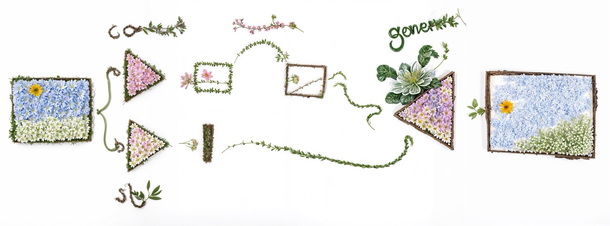

Back in the GAN days most of my time was spent playing with famous models like [StyleGAN](/tags/stylegan/) and [pix2pix](/tags/pix2pix/). But another of my favourite models, which was much less well known, was [Swapping Autoencoder](https://taesung.me/SwappingAutoencoder/), a lovely model from Adobe research for which all the code and checkpoints were released. This is a little post for me to give the model a little of the love it deserves and to record some of the things I made with it.

The basic principle is to try is to generate images but to separate control of the large scale structure from the small scale texture/style details, and to learn this ability without any access to specially created data.

I'm not going to describe how it's trained (the [paper](https://arxiv.org/abs/2007.00653) is fairly accessible if you're interesting), but in the end the model encodes and image into to parts: a style and a structure code. With style being defined as the idea that multiple small crops should plausibly look like they came from the same image. Then you can generate new images with the model by providing a style and structure code, and the cool bit being that you can arbitrarily swap these between different images to get new unexpected things!



Schematic of the training scheme of Swapping Autoencoder from: ["Swapping Autoencoder for Deep Image Manipulation"](https://arxiv.org/abs/2007.00653)

The intended way to use the model was to take the content representation from one image, and the style from another to do a sort of "style transfer", although each model was limited to a single domain like landscapes, churches etc. So it was more like a texture/appearance transfer. But there were a lot more interesting things you could do with these broken down latent codes. And I spent a lot of time experimenting witht things and made a tremendous number of images and videos I found fascinating, and here are a bunch of them:

## Spatially blending landscapes

First off it's fun to take two image and encode them into style and content, then squash the two content feature blocks together side by side (with maybe some interpolation where they meet), pick one of the styles or combine them, then generate a new image. You get pleasantly blended impossible landscape images this way.





## PCA latent editing

Another classic technique from the StyleGAN era is to find latent directions in whatever latent space you are working in. GANSpace introduced the idea of encoding a bunch of images then doing PCA to find promising directions. The directions I found encoded in the Swapping Autoencoder latent space are a bit odd, but probably with more effort you could find more semantically meaningful ones. (But who need semantic meaning when you can have weird ones?)



I can't actually remember if this is a latent direction in the style or content space, but either way it's probably roughly the "more clouds" direction.

## CLIP guidance

Around this time was the CLIP guidance craze. I thought I'd have a go using applying the typical CLIP loss to optimise the swapping auto-encoder style latent based on a text prompt. As you can imagine this works pretty well for image editing.



Original image on the left. Optimisation of the Swapping AE style vector with a text prompt of something like "lush green trees" and resulting image on the right.

I also tried optimising the content latent image with CLIP, this turns out weird, but quite interesting. Much less recognisable stuff, but a lot of interesting textures going on.




## Unsynchronised style/content video generation

The autoencoding ability of Swapping AE is sufficiently good that you can auto-encode a video and it still looks fairly good (apart from the texture sticking we are all familiar with from non-StyleGAN3 GANs). I don't know why you would want to do that. But if you offset in time or average or otherwise mess with the style and content encodings relative to each other you can create some interesting video transition effects:

<video controls src="https://assets.justinpinkney.com/blog/swapping-autoencoder/landscape_swap_1.mp4" loop="false" preload="auto"></video>

## Recursive content transformation videos

<video controls src="https://assets.justinpinkney.com/blog/swapping-autoencoder/recursion_1.mp4" loop="false" preload="auto"></video>

Another fun effect I stumbled across was making videos my recursively encoding and then generating an image over and over, then you can stitch all the generated images together to make a video, like the one above.

It gets more interesting if you apply a transformation to the content encoding between each frame. Something like a simple zoom in/out or a rotation give all sorts of weird and wonderful patterns emerging .



A little schematic of how each video frame is generated with transforms applied to the content encoding.

<video controls src="https://assets.justinpinkney.com/blog/swapping-autoencoder/swapping-video-02.mp4" loop="false" preload="auto"></video>

<video controls src="https://assets.justinpinkney.com/blog/swapping-autoencoder/swapping-video-08.mp4" loop="false" preload="auto"></video>



## Train rides

I also used Swapping Autoencoder for one of my earlier attempts to make [synthetic train rides](/blog/2023/latent-train/#swapping-autoencoder).

https://youtu.be/ITrWUeHqwu4?si=ggp1KoFoimbCmlvt

## The end

Well that's about it, and interesting model with plenty of scope to play with. As with most GANs it's a domain limited model and not general purpose. Maybe in the brave new world of diffusion we could train something that can do anything. But it's not exactly obvious how to train something like this with diffusion, the style training learns to match a distribution indirectly as the loss is defined by the Discriminator enforcing that crops should match the data distribution of other crops. With the direct, incremental loss of diffusion how to do this seems less obvious. Though there are other diffusion based methods which try and seperate style and content. (I'll add a list sometime...)