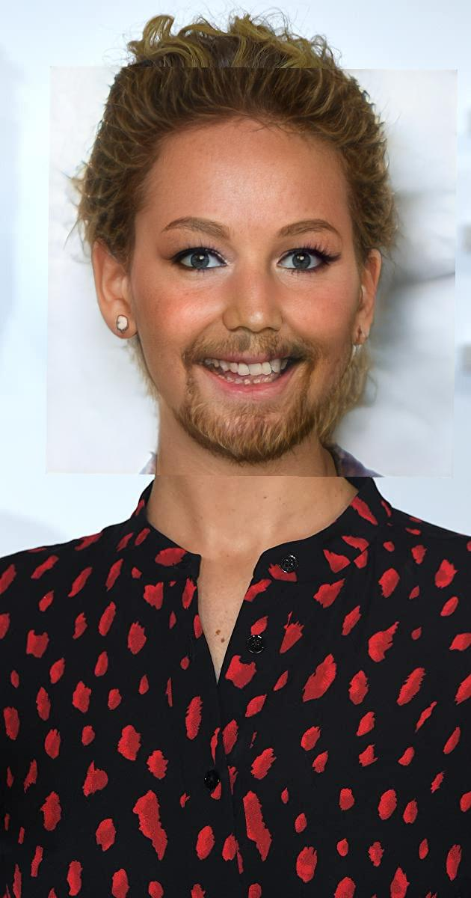
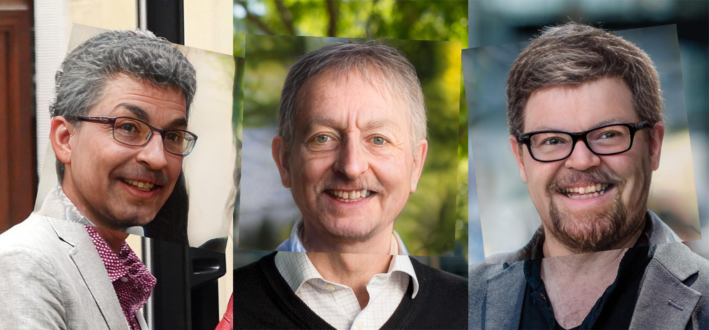
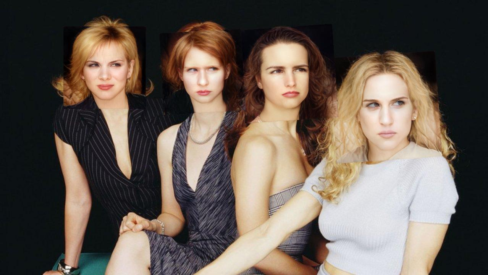
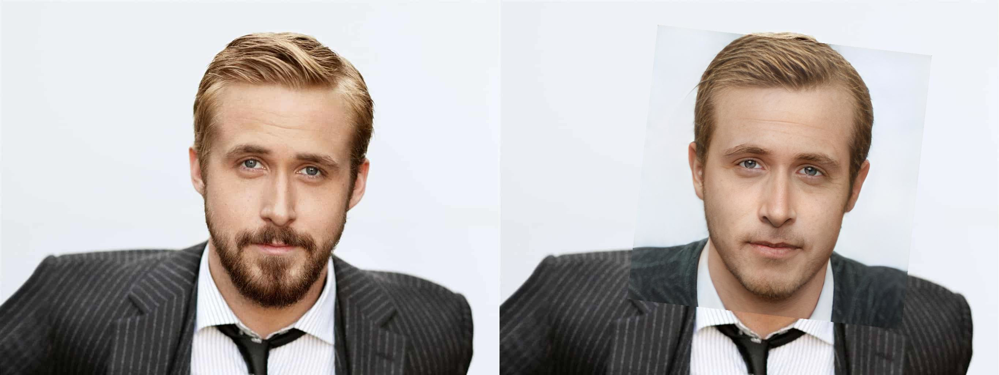
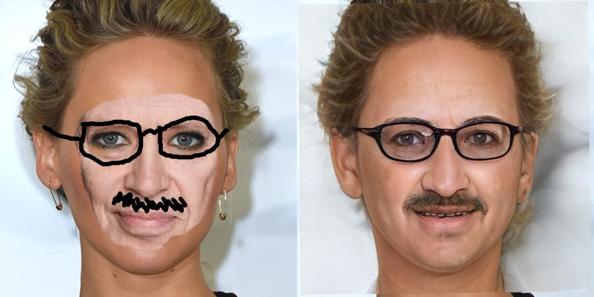
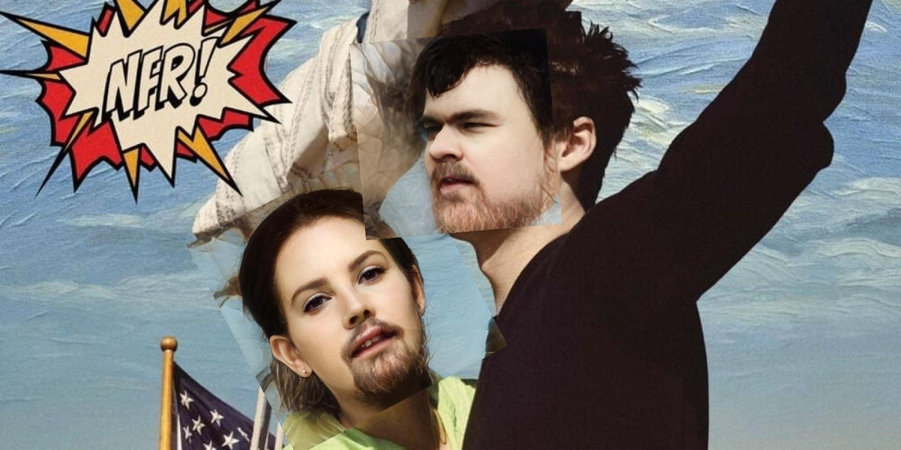
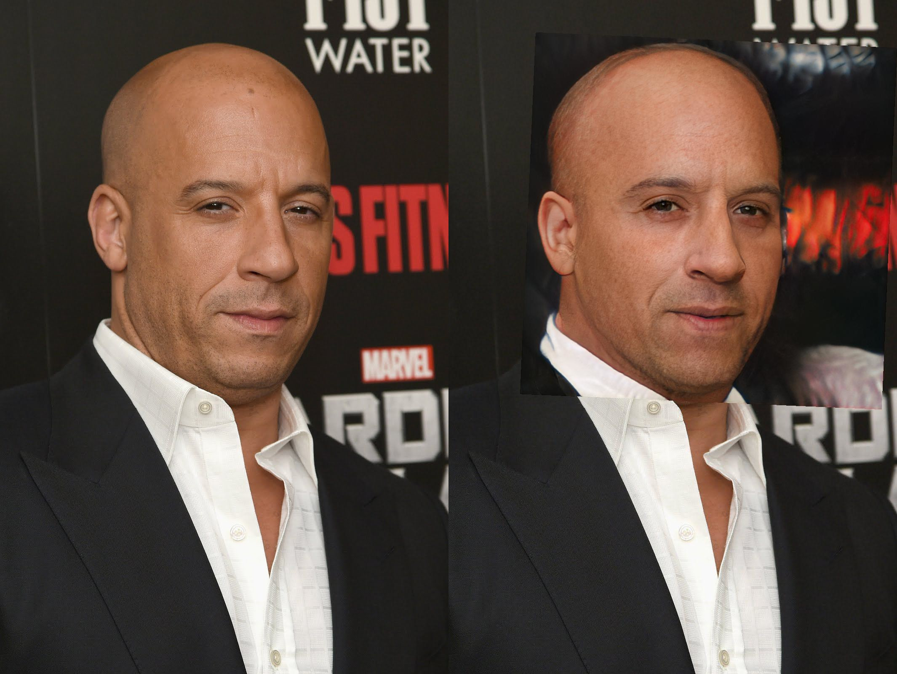
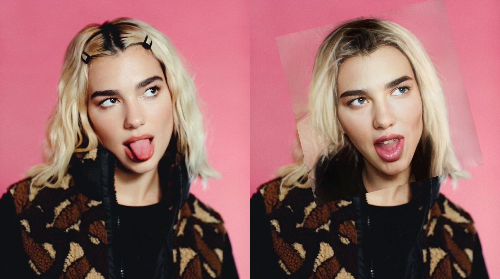

__Repository: https://github.com/justinpinkney/pixel2style2pixel/__

A little while back I ported a couple of recent machine learning models to Runway: "[Encoding in Style](https://arxiv.org/abs/2008.00951)" (aka Pixel2Style2Pixel or PSP)[^psp] and "[Style Space Analysis](https://arxiv.org/abs/2011.12799)"[^style-space]. They work well together, PSP for encoding an existing image into the latent space of a Generative model, and Style Space Analysis for editing that image in the latent space of StyleGAN. Here's a post on some of the technical details of how it works.

### Pixel2Style2Pixel 

PSP demonstrates a highly effective method for encoding real images in the latent space of a pre-trained generative model. The [repository](https://github.com/eladrich/pixel2style2pixel) provides a pre-trained encoder for finding the latent vector corresponding to an image your supply. There is also some cool follow up work called Encoder4Editing which might be even better for this application.

They even use the good old [[toonify-yourself:Toonify model]] in their research as part of demonstrating the flexibility and generality of their face encoding approach.

### Style Space Analysis

StyleSpace Analysis is a paper with a nice idea which seems to not have gained much attention. It shows that as well as the typical Z and W latent spaces of StyleGAN, there is another latent space: StyleSpace, which provides extremely localisable edits to images. <strike>Unfortunately there is no code accompanying Style Space Analysis, but</strike> There is now [code for StyleSpace analysis](https://github.com/betterze/StyleSpace)! The channels used to edit various attributes are provided in the paper and delving into the PyTorch version of StyleGAN 2 using forward hooks to modify the appropriate values is pretty straightforward.

### Other code

I also use some existing code for face alignment from the [FFHQ-dataset](https://github.com/NVlabs/ffhq-dataset) repository to ensure faces are aligned as expected by the StyleGAN model. I combine this with a pre-trained face detector from dlib, and add some extra code to "undo" the alignment to replace the edited face back in the original image. This involves some fairly straightforward code using OpenCV to estimate the inverse transform and apply this to align the face back into the reference frame of the original image.

## Let's edit!

Now with these various bits of model code put together and stuck into the nice interactive RunwayML interface, it's easy to do some Face editing. PSP provides the means of embedding a set of real world faces in the latent space of StyleGAN2 and StyleSpace analysis lets us modify some interesting attributes. By placing this edited face back in the original image we can create some fairly realistically edited images.

Here are some examples of facial hair, expression, and make up editing.

The encoder is also flexible enough that it can work with some non-photographic images too.

As the output of the model is constrained by the pre-trained generative model, it can also take unrealistic faces and translate them into realistic ones. It can then be used for blending composite "identikit" type faces, or even translating crude overlays (such as drawn glasses or cartoon moustaches) into realistic images.

This is actually the same technique I used to mock up a face editor app integrated with GIMP

<Vimeo vimeoId="536038892" />

There's also no particular reason why this should be limited to faces. I'd love to see more of these techniques applied to editing landscape images, but this would require a high quality landscape model trained using StyleGAN2...

## Could try harder

This is pretty quick and dirty, but effective. There are some pretty obvious things that could make it nicer

### Blending the composite image

After compositing the image back into the original, the borders are generally fairly obvious. A straightforward method to improve this would simply be to perform poisson blending of the modified and original image. Or a more sophisticated method could involve segmentation of the person or the attribute region of interest from the modified image to remove the background before compositing back into the original.

### Poor embedding

PSP hates bald people. It believes they should all have comb-overs, check out the image of Vin Diesel (encoded with no edits) below. A bit of extra optimisation of the encoded latents based on a perceptual similarity measure of the original image (e.g. LPIPS) might re-find the baldness.

In other cases I'm not sure any further fine tuning would help. I'm pretty sure the FFHQ model doesn't know anything about tongues.

### Batching

The current code just processes each face in the image individually. It would be a bit more efficient to batch these up. However I don't know the configuration of the remote GPU machine Runway uses, so don't know what batch size I could work with without risking an out of memory error.

## References

[^psp]: Richardson, Elad, Yuval Alaluf, Or Patashnik, Yotam Nitzan, Yaniv Azar, Stav Shapiro, and Daniel Cohen-Or. 2020. “Encoding in Style: A StyleGAN Encoder for Image-to-Image Translation.” arXiv [cs.CV]. arXiv. http://arxiv.org/abs/2008.00951.

[^style-space]: Wu, Zongze, Dani Lischinski, and Eli Shechtman. 2020. “StyleSpace Analysis: Disentangled Controls for StyleGAN Image Generation.” arXiv [cs.CV]. arXiv. http://arxiv.org/abs/2011.12799.