A bunch of quick experiments for my improved CLIP Image conditioned version of Stable Diffusion v1. Find the actual [model on huggingface hub](https://huggingface.co/lambdalabs/sd-image-variations-diffusers). We'll be using this crop from a Ghibli frame as our test image.

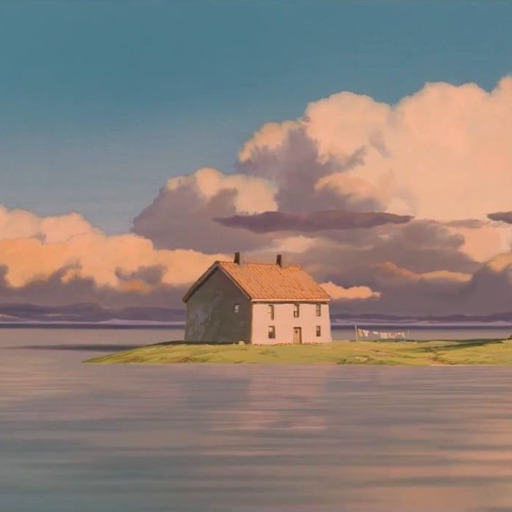

This is what the standard variations model produces when you feed this image in:

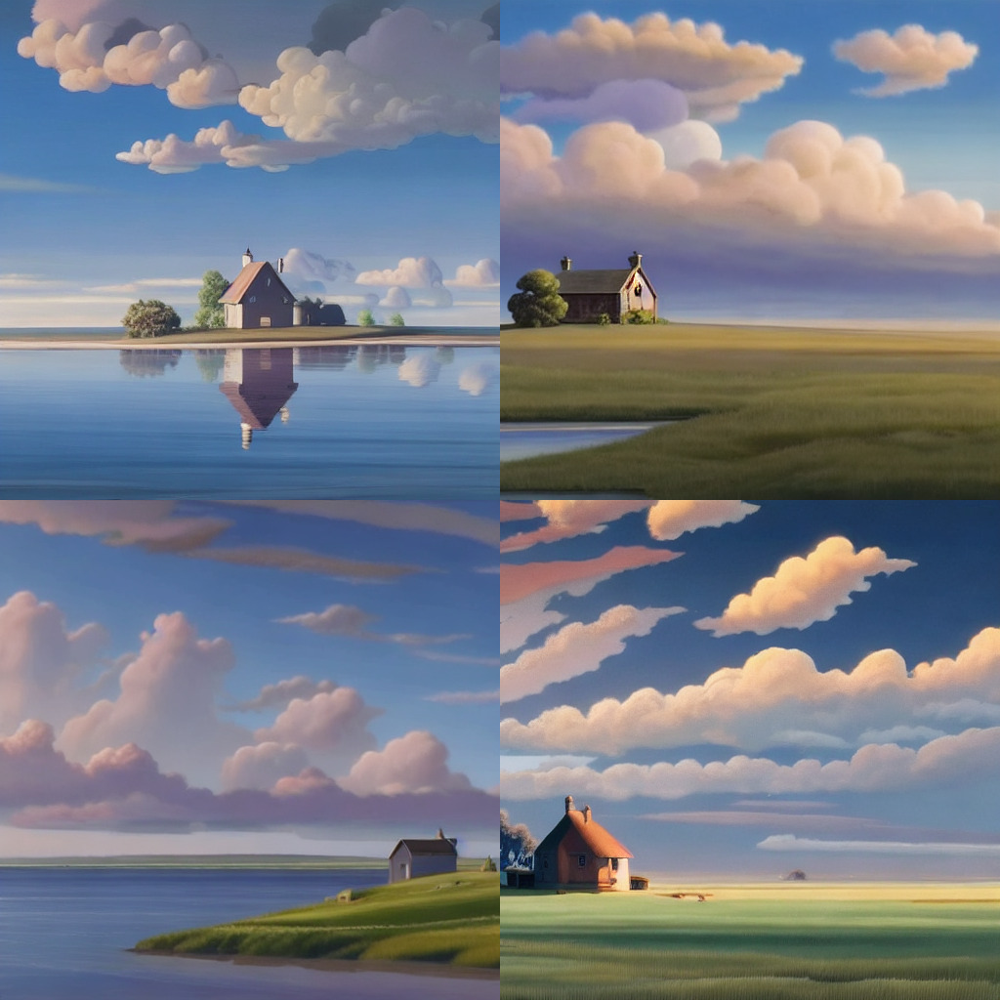

That was classifier free guidance scale 4, we can play with different levels of guidance: (0, 1, 2, 4, 8)

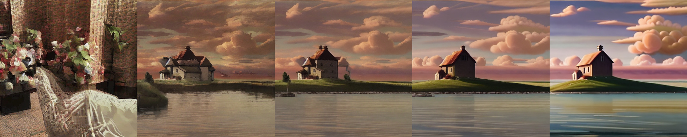

The image is turned into a CLIP image embedding, this is the condition vector. 0 corresponds to the "unconditional vector" so in addition to the usual classifier free guidance we can play with the length of this vector to control the "strength" of the conditioning. Multiply the vector by 0.25, 0.5, 1, 1.5, 2:

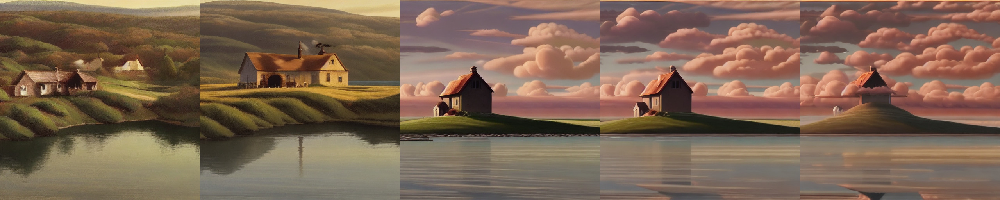

We can also mix different embeddings by averaging them together. Let's mix between the embedding for our ghibli image and a matisse painting. 0%, 25%, 50%, 75%, and 100% matisse:

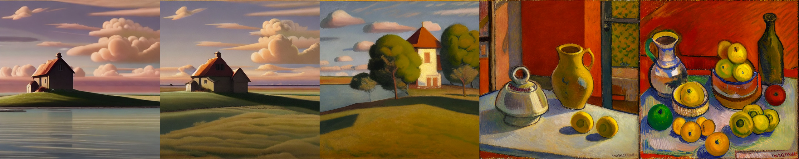

Another way to mix is to concatenate the embeddings, yes we can have more than one if we want to. Here we do the following

- ghibli, ghibli
- ghibli, uncond
- ghibli, matisse

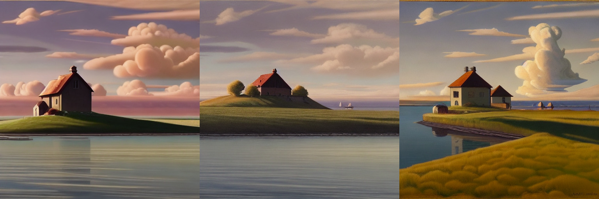

We can also use text embeddings to mix with our image embedding, we can mix with the word "flowers" to add flowers. At the far right it's only using the text "flowers" (we re-invented a text to image model!). 0%, 25%, 50%, 75%, and 100% "flowers":

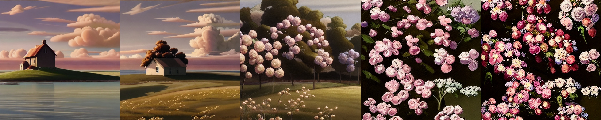

We can do the same trick of concatenating the embeddings instead of averaging, it's a bit funny though

- ghibli, flowers
- ghibli, flowers, flowers
- ghibli, ghibli, flowers
- ghibli, ghibli, flowers, uncond, uncond

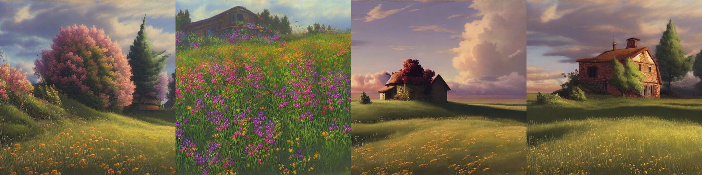

More natural is to maybe use a direction in text embedding space to edit our ghibli conditioning. We can use the direction "still water" -> "wild flowers" and add this at different scales to your original conditioning. Here it's adding 0%, 10%, 25%, 50% and 100% of the edit vector "still water" -> "wild flowers":

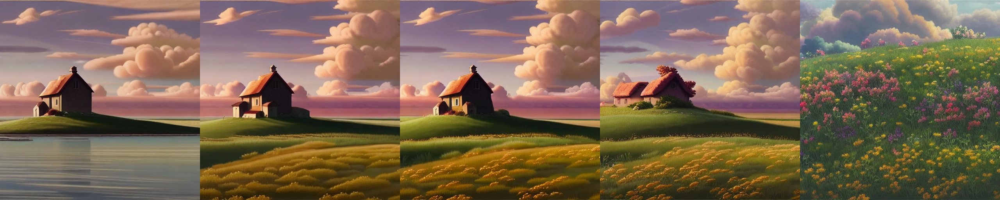

Changing tack we can experiment with adding noise to our condition vector
with scales = 0, 0.1, 0.2, 0.5

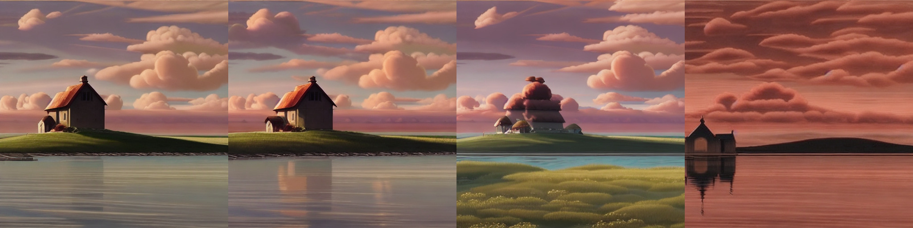

Or use multiplicative noise instead, scales = 0, 0.2, 0.5, 0.75

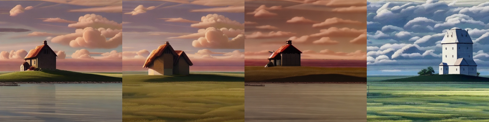

If we take random crops when computing the embeddings we get zoomed in images mostly, a bit boring.

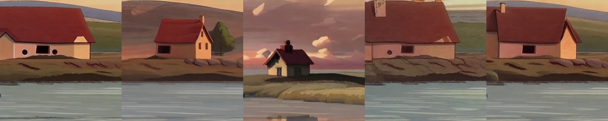

Now we play with DDIM inversion, followed by editing, as shown in the DALLE-2 paper. We invert our image, we need to use lots of timesteps.
Then check we can decode it to pretty much the same image (if we use cfg it's more saturated). To get good inversion results we use: ddim_steps = 500, start_step=1, cfg scale = 3 (careful with cfg scale! not too high)

For decoding you don't need to use so many timesteps, so it wont take so long, decode with 50 timesteps and you get the original picture back

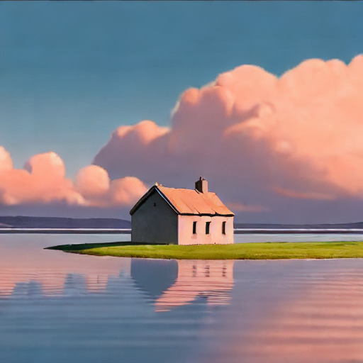

Now we use our same text diff as before to replace the water with flowers! 10%, 20% 50% 100% and 150% edit:

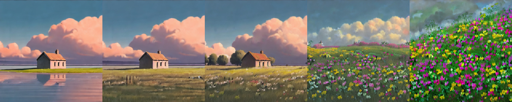

Or how about turn the house into a lighthouse? 10%, 20% 50% 100% and 150% edit:

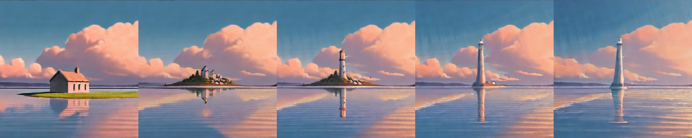

We can also use ddim_eta to make variations of our original, but ones that closely match in composition. Here each row is for ddim_eta 0.3, 0.6, and finally 1:

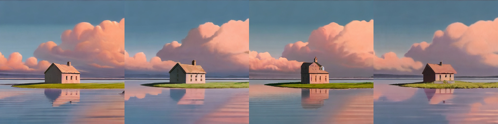

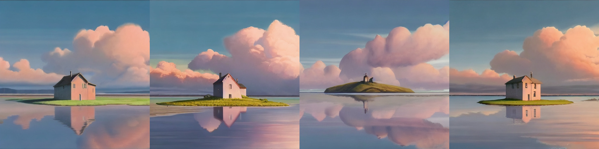

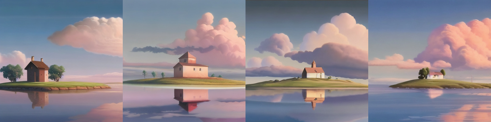

Last of all we can combine subtle variation (ddim_eta=0.4) with text diff editing:  "ghibli matte painting" -> "dslr leica photo"

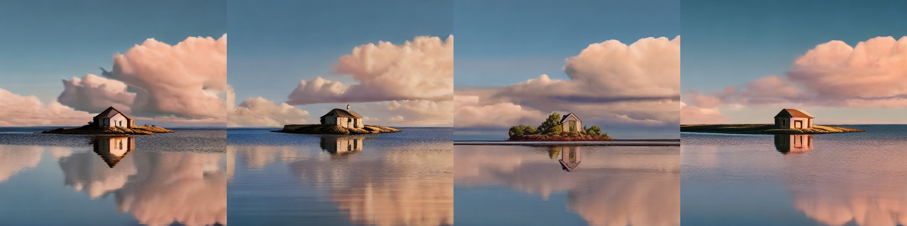

