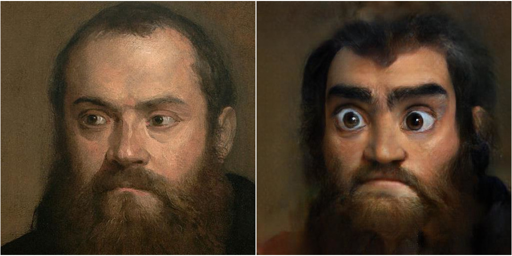
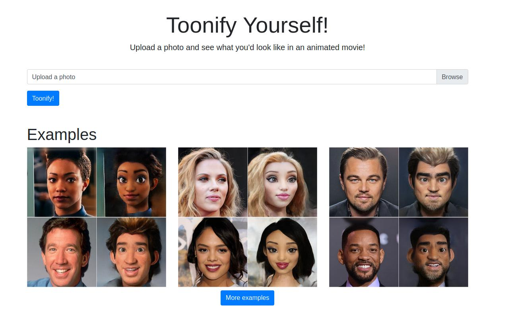
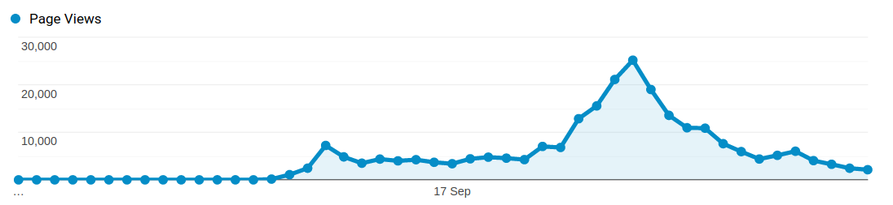
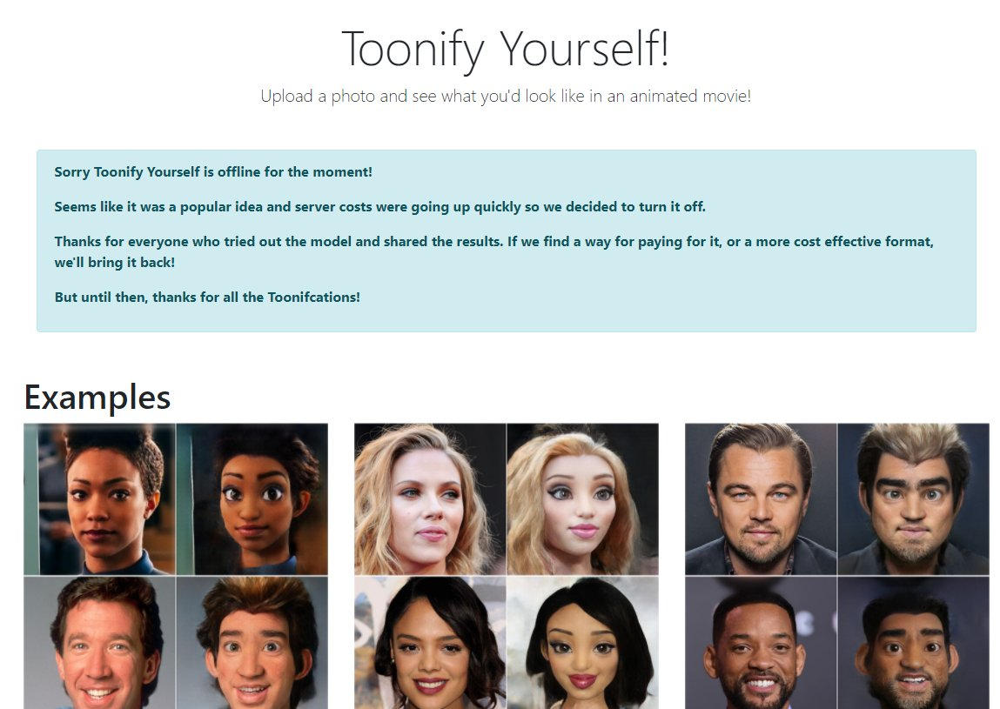

---
title: Making Toonify Yourself
date: "2020-09-20"
description: The story of deploying a deep neural network to the cloud and Toonifying tens of thousands and images an hour.
cover: toonify.jpg
--- 

So [Doron Adler](https://linktr.ee/Norod78) and I recently released our toonification translation model at our Toonify Yourself website. It turned out to be pretty popular with tens of thousands people visiting in the 22 hours it was running for, submitting almost a quarter of a million images for toonification.

<Tweet tweetLink="Buntworthy/status/1306236896125870080" />

It got quite a bit of interest on social media, and picked up on a few websites. Unfortunately we had to turn off the toonification server before costs started to get out of hand, but we're working on bringing it back so people can carry on playing with the model for free.

A lot of people have expressed interest in how the model work and how the website was run. So here's a blog post with some details on the traffic and running costs, as well as the technical details of how to run a deep neural network in the cloud serving tens of thousands of requests an hour!

## Making an efficient Toonification model

__If you want to know about the details of the original Toonification model, see [[toonify-yourself:this blog post]].__

The original Toonification method involved an expensive optimisation process to encode a person's face using the blended StyleGAN model which can take several minutes to run even on a GPU. Clearly this wasn't going to cut it as a web app! A common pattern in deep learning is replacing expensive optimisations with more neural networks[^style-transfer]. We used the basic idea described in _StyleGAN2 Distillation for Feed-Forward Image Manipulation_[^distillation], i.e. training a pix2pixHD model to apply the transformation to any arbitrary image, rather than first having to perform the optimisation step.

The novel part here is that the pairs of images we use for the training process are pairs produced by the original FFHQ model and the blended model[^new-model]. Although the pix2pixHD model is only trained on image generated by the two StyleGAN models, when it's done we should be able to apply it to any image and get the same toonification result

## Deploying the model

So after the initial interest on Twitter about my experiments putting together a local web app for myself to run the Toonify model I decided to take a crack at putting up a website where anybody could run it on their own images.

First things first I wasn't going to be running anything on a GPU, so I needed to get the pix2pixHD model runnable on a CPU. The original pix2pixHD repo has some bugs which prevent inference without a GPU and I fixed these [on my fork](github.com/justinpinkney/pix2pixHD/) if anyone is interested. In the end I actually decided to export the model to ONNX format so I could run it using the ONNX runtime. This makes the dependencies more lightweight than trying to run using PyTorch and (I hope) the ONNX runtime is built with performance in mind.

I went for Google Cloud Run as a means of deploying the web app. All the thing needs to do is accept an image, run inference, and return the result. It's totally stateless so a good fit for the Cloud Run model. The use of Docker containers in Cloud Run meant that it was easy for me to bundle up any required dependencies, scalability was built right in and there is a generous free allowance (not generous enough it would turn out!).

So after a few evenings of putting together a small app using Flask and Bootstrap, things were ready to deploy!

## Toonification in the Wild

So after some beta testing with friends I announced the release of the [Toonify Yourself](https://toonify.justinpinkney.com) website on Twitter. It quickly got some reasonable traffic and people seemed to be enjoying trying the model out on themselves.

Some were complaining that their faces were never detected no matter what they submitted, and I fairly quickly figured out (and many helpful people online started to point out) that it was an issue with image rotation on iPhones[^transpose].

By the next morning traffic started to really pick up, partly due to getting on the front page of [Hacker News](https://news.ycombinator.com/item?id=24494377). I was starting to get a little bit twitchy seeing the number of containers spun up on Cloud Run steadily increasing. As lunch time approached we were getting close to 25,000 page views an hour, at times this was requiring 100 containers to service the traffic, and thing were going up fast.
    

The measly number of free cpu and ram minutes had long since evaporated, and I was getting a little concerned about what the cloud bill was going to be after I came back from an afternoon out of the house. So rather than limit things to a level that most people would get a non-response from the site, I decided to turn off the model and switch to an apology message.

## The numbers

In the end we had close to a quarter of a million page views before I shut down the toonification. Not every one of these corresponds to someone submitting an image, but it's not far off, and each user submitted around 3 or 4 images for toonification.

So how much did this all cost? Not quite as much as I thought, I had set a personal limit of spending around $100 on this and I didn't break that. But here are some details of what it costs to run a service like this.

The model takes about 5 seconds to run inference on whatever hardware Cloud Run uses, and occupies around 1.4 GB of memory whilst doing it. It also takes a slightly astonishing 20 seconds to load the model the first time a container is brought up (and this happens more than I'd like), and the memory peaks at well over 2GB during this period. All this meant that processing a thousand images probably costs around 30 cents (footnote: there are also some other smaller costs like network egress to think about, but that's not much extra), which isn't too bad, but when you're trying to process 25,000 an hour, starts to add up fast!

I'm still pretty amazed that it was so easy to build a site which could service so much traffic and do some serious image processing in the cloud. I've never used any of this scalable serverless technology before, but it was incredibly easy to get going!

## Feedback 

A lot of people commented that the images produced didn't preserve enough of the original character of the person, that they ended up looking pretty generic, and that a human cartoonist could do a far better job. I fully agree, there is not way deep learning is going to outperform a skilled artist any time soon! But there is also no way you could get skilled human artists to make cartoon versions of people for 30 cents per thousand.

Despite me putting a line in the FAQ assuring people I was not storing or collecting their images (how on earth would I have afforded that!?) several people commented on it with scepticism, surely something free online must be harvesting your data somehow? But honestly once the toonification was done the original image and the result were gone forever (for me at least). Plus I don't really see why people were worried, people have already happily uploaded millions of photos of themselves to the internet and social media sites, who explicitly do make money from your data. If companies want to collect face data, a silly website like mine is not the way to do it!

## The future

We're currently working on getting the website back up and running again. I'm not keen on the obvious (and suggested by many) strategy of just plastering ads everywhere. But the success of the website has sparked many interesting conversations for me, and I think one of them will lead to a solution pretty soon.

__So watch this space (or my Twitter feed) Toonify Yourself will be back!__

## Twitter

Lots of people shared fun examples on Twitter, here are a few:

<TwitterTimeline username="Buntworthy/timelines/1308129916114939904" height="650px" />

## Coverage

Here are some links to the coverage this got.

- [Pocket lint - How to Toonify yourself: See what you'd look like in a cartoon movie](https://www.pocket-lint.com/apps/news/153848-how-to-toonify-yourself-see-what-you-d-look-like-in-a-cartoon-movie)
- [Gigazine - I tried using 'Toonify Yourself!' Which can convert your face into Disney animation style](https://gigazine.net/gsc_news/en/20200917-toonify-yourself/)
- [Meduza - Medusa tried Toonify, a service that turns you into cartoon characters. Well, or in a man of the Neolithic era](https://meduza.io/shapito/2020/09/17/meduza-ispytala-toonify-servis-kotoryy-prevraschaet-vas-v-personazhey-multfilmov-nu-ili-v-cheloveka-epohi-neolita)
- [This AI Transform Faces into Hyper-Realistic Cartoon Characters](https://youtu.be/7Oqpiaj0IUM)
- [The three giants of deep learning have also become cute, this one-click conversion of animated movie images is actually offline due to "too hot"](https://tech.sina.com.cn/roll/2020-09-20/doc-iivhuipp5388256.shtml)

__TODO__

[^style-transfer]: For a classic example see the work on neural Style Transfer.

[^distillation]: Viazovetskyi, Yuri, Vladimir Ivashkin, and Evgeny Kashin. ‘StyleGAN2 Distillation for Feed-Forward Image Manipulation’. ArXiv:2003.03581 [Cs], 7 March 2020. http://arxiv.org/abs/2003.03581.

[^new-model]:  Doron actually spent some time assembling new datasets and training a new models so the results you see are a bit different to the ones I originally shared.

[^transpose]: Portrait images are actually saved as landscape on iPhone and the rotation is embedded in the metadata. You can apply this rotation in Pillow using `ImageOps.exif_transpose`