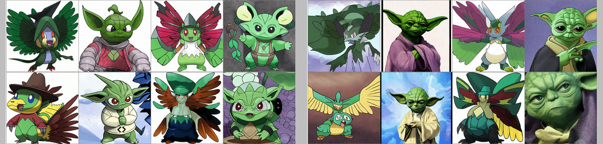

If you want to just try out the model look here:

__All of this work was done as part of my [[day job]] at [Lambda Labs](https://lambdalabs.com/) and all the real details of how the model was made, and how you can make one yourself are in this post on the [Lambda Examples repo](https://github.com/LambdaLabsML/examples/tree/main/stable-diffusion-finetuning). This blog post just has a few extra details and notes on my experience__

_Girl with a pearl earring, Cute Obama creature, Donald Trump, Boris Johnson, Totoro, Hello Kitty_

There's been much excitement about Stable Diffusion's recent release as you might expect. Sure it's great at making some interesting images but there are a lot of possibilities than just putting in words and getting out pictures. To me it feels like a similar moment to shortly after StyleGAN was released: A powerful, high quality model, publicly accessible, and simple enough to for people to play with, adapt and fine tune for their own purposes.

I've been doing some experiments with the model since it came out. One was changing the input conditioning to [enable "image variations" with Stable Diffusion](https://twitter.com/Buntworthy/status/1566744186153484288), but this post is just a little summary of some more straightforward initial experiments in simple fine-tuning of the model to turn everyone into a Pokemon!

## Catastrophic forgetting?

One of the amazing things about this model is that it manages to remember some of the "general knowledge" of the original stable diffusion. It doesn't seem obvious that it should do so after training for a few thousand steps on such a limited dataset, but there's a trick involved here! When fine tuning on the Pokemon the model actually starts to overfit quite quickly, and if you sample from it in a naive way it just produces Pokemon-ish gibberish for novel prompts (it has catastrophically forgotten the original data it was trained on), but like many modern networks Stable Diffusion keeps an exponential moving average (EMA) version of the model during training, which is usually used for inference as it gives better quality. So if we use the EMA weights we're actually using an average of the original model and the fine-tuned one. This turns out to be essential in order to turn all those famous people into Pokemon. You can even fine tune this effect by directly averaging the new model with the weights of the original to control the amount of Pokemonification.

<Tweet tweetLink="Buntworthy/status/1567804278949007360" />

Turns out that this is basically the same mechanism that enabled [[toonify yourself]], fine tuning and averaging model means you can end up with an effective mix of the original content with the style you fine-tuned on!

## More experiments

It does seems a bit excessive to fine tune the whole unet as I did in the example above. There are probably lots of different strategies you could adopt trying to freeze different parts of the model, or even try something like [[stylegan-network-blending:layer swapping]]. One little experiment I tried along these lines to to fine tune only the Attention layers in the the unet. This version helps to preserve the original abilities of the model, but reduces the quality of the Pokemon produced. It's neat the model still remembers how to produce non-pokemon images, but this isn't quite what we want for this application, as it's good that the model ends up producing nothing but Pokemon!

_Left is the fully fine-tuned model. Right is attention layers only. The right model can clearly generate a more "normal" yoda, but is less good at making Pokemon._

An obvious next step is to try and compare the above fine-tuning with a method like [DreamBooth](https://dreambooth.github.io/). If anyone gets round to trying this before I do, please [[find-me:let me know]] how it goes!

## Vivillon is the Rick Astley of Pokemon

Some people pointed out that the model has a tendency to randomly produce a certain Pokemon, Vivillon for seemingly random prompts. Even when it doesn't make Vivillon exactly it still has a strong preference to make circular radially patterned Pokemon when the prompt is a bit more abstract.

<Tweet tweetLink="JanelleCShane/status/1575855505922088960" />

Someone pointed out that Vivillon actually has several variations, each of which is a different Pokemon, this means it appears a bunch of times in the original dataset. The model clearly ended up overfitting to Vivillon, I might make a version where I remove all but one Vivillon, but right now I quite enjoy that Vivillon occasionally appears when you least expect it like a Pokemon Rick Roll.

<Tweet tweetLink="MrCheeze_/status/1575857534874705920" />

## Coverage

I tweeted about the model when I released it, but seems like it took a little while before it really took off. In particular this tweet seemed to really reach the right audience:

<Tweet tweetLink="JDune5/status/1574143254366388232" />

Since then it's been featured here:

- [The Washington Post - Create surreal Pokémon lookalikes of Jeff Bezos, The Rock and more with AI](https://www.washingtonpost.com/video-games/2022/09/29/pokemon-ai-generator-github/)
- [The Verge - Turn anyone into a pokémon with this AI art model](https://www.theverge.com/2022/9/26/23372457/pokemon-ai-generator-stable-diffusion-model)
- [Creative Bloq - This spot-on AI Pokémon generator has me hooked](https://www.creativebloq.com/news/text-to-pokemon-ai-art-generator)
- [The Gamer - This AI Generates A Pokemon Based On Your Name](https://www.thegamer.com/pokemon-ai-generator/)
- [TechCrunch - Make your very own AI-generated Pokémon-like creature](https://techcrunch.com/2022/09/28/make-your-very-own-ai-generated-pokemon-like-creature/)
- [Nerdist - Turn anything into Pokémon with this new AI program](https://nerdist.com/article/turn-anything-into-pokemon-with-this-ai-program/)
- [Screen Rant - AI Generator Turns You Into A Pokémon (But You're Not Going To Like It)](https://screenrant.com/pokemon-ai-generator-custom-characters-scary/)
- [Yahoo - Turn Anything into Pokémon with This New AI Program](https://www.yahoo.com/lifestyle/turn-anything-pok-mon-ai-210003616.html)

and plenty of other places.