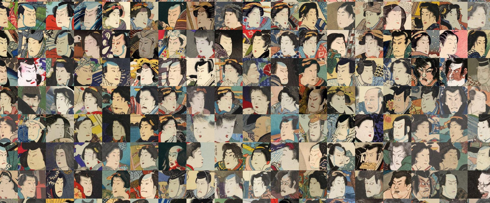
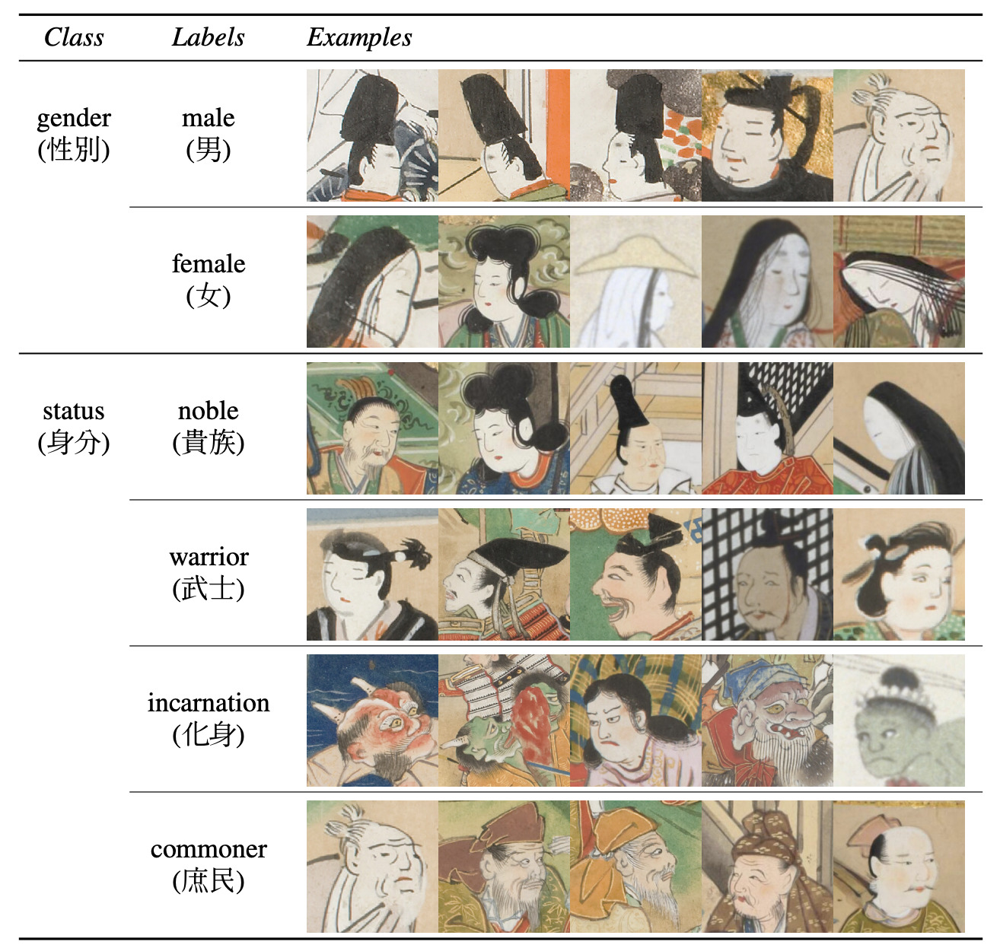

import StructuredData from "../../../src/components/StructuredData"

<StructuredData />

__[Download the dataset: V2](https://drive.google.com/file/d/1zEgVLrKVp8oCZuX0NENcAeh-kdaKJzNG/view?usp=sharing)__ 



As part of my paper [Resolution Dependent GAN Interpolation for Controllable Image Synthesis Between Domains](https://arxiv.org/abs/2010.05334)[^rdgi] I use a dataset of Ukiyo-e face images for training a StyleGAN model, this post contains a link to, and details of that dataset.

## Updates

- V2 - Removed 28 bad quality images (poor alignment or not face).
- V1 - Initial release used in the paper _Resolution Dependent GAN Interpolation for Controllable Image Synthesis Between Domains_

## The dataset

import BigImage from "../../../src/components/BigImage"

<BigImage 
    options={ {center:[-0.25, 0.35], zoom:12, minZoom:9, maxZoom:15 } } 
    tile_url="https://assets.justinpinkney.com/blog/ukiyoe/ukiyoe_files//{z}/{x}_{y}.jpg" />

The ukiyo-e faces dataset comprises of 5209 images of faces from ukiyo-e prints. The images are 1024x1024 pixels in jpeg format and have been aligned using the procedure used for the [FFHQ dataset](https://github.com/NVlabs/ffhq-dataset). Above is a map of (almost) all the images in the dataset, images are plotted such that similar faces appear close together[^map]. The images have been downscaled to 256x256 for display.

## Further details

Images are scraped from several museum websites, I then used Amazon Rekognition to attempt to detect faces and facial landmarks from each image. Rekognition does a reasonable job at both tasks, but is clearly imperfect, many faces are missed and there are alignment errors in many of the images. Many of the images are not of very high resolution, so to produce a useable dataset at 1024x1024 resolution I use a pre-trained ESRGAN[^esrgan] model [trained on the Manga109 dataset](https://upscale.wiki/wiki/Model_Database) to upscale the images where required, these leaves some artifacts but generally does a good job.

## Other datasets

[KaoKore](https://github.com/rois-codh/kaokore) is another dataset of Ukiyo-e faces[^kao], it is more varied and labelled, however the image resolution is lower and faces are not aligned.



## License and usage


This dataset is provided under a [Creative Commons Attribution-ShareAlike 4.0 International License](https://creativecommons.org/licenses/by-sa/4.0/).

If using the dataset please cite as "Aligned ukiyo-e faces dataset, Justin Pinkney 2020" or for a bibtex entry:

```
@misc{pinkney2020ukiyoe,
      author = {Justin N. M. Pinkney},
      title = {Aligned Ukiyo-e faces dataset},
      year={2020},
      howpublished= {\url{https://www.justinpinkney.com/ukiyoe-dataset}
} 
```

[^rdgi]: Pinkney, Justin N. M., and Doron Adler. ‘Resolution Dependent GAN Interpolation for Controllable Image Synthesis Between Domains’. ArXiv:2010.05334 [Cs, Eess], 20 October 2020. http://arxiv.org/abs/2010.05334.


[^map]: To generate this image I first extract CNN features from each image using a ResNet50 pre-trained on Imagenet. These high-dimensional feature vectors are then projected into two dimensions using UMAP, grid assigment is then done using the lapjv algorithm.

[^esrgan]: Wang, Xintao, Ke Yu, Shixiang Wu, Jinjin Gu, Yihao Liu, Chao Dong, Chen Change Loy, Yu Qiao, and Xiaoou Tang. ‘ESRGAN: Enhanced Super-Resolution Generative Adversarial Networks’. ArXiv:1809.00219 [Cs], 1 September 2018. http://arxiv.org/abs/1809.00219.

[^kao]: Tian, Yingtao, Chikahiko Suzuki, Tarin Clanuwat, Mikel Bober-Irizar, Alex Lamb, and Asanobu Kitamoto. ‘KaoKore: A Pre-Modern Japanese Art Facial Expression Dataset’. ArXiv:2002.08595 [Cs, Stat], 20 February 2020. http://arxiv.org/abs/2002.08595.
