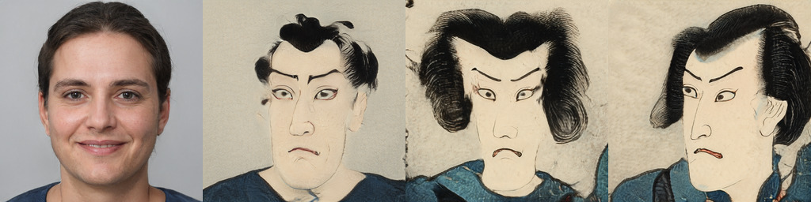
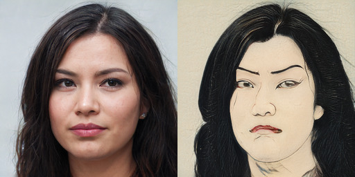
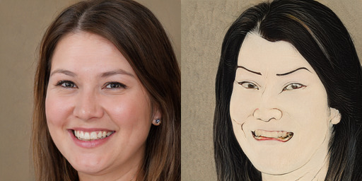
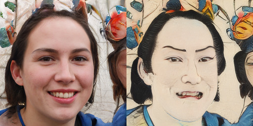
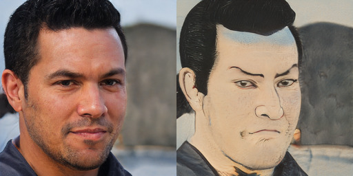
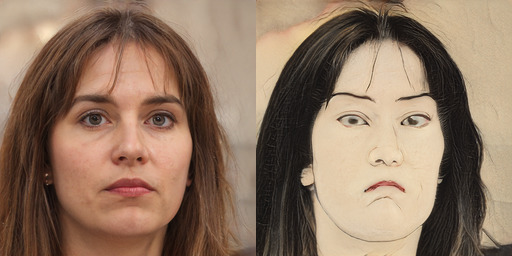
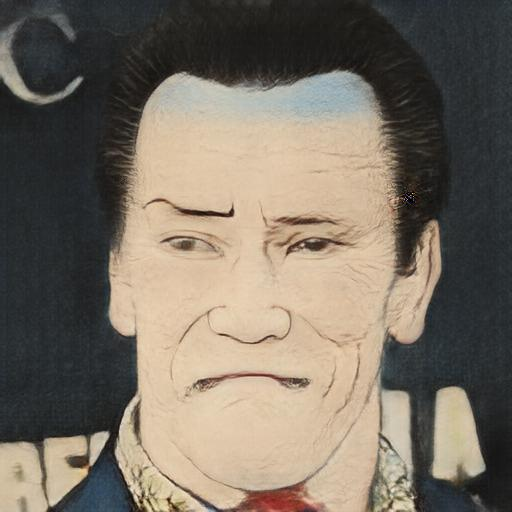
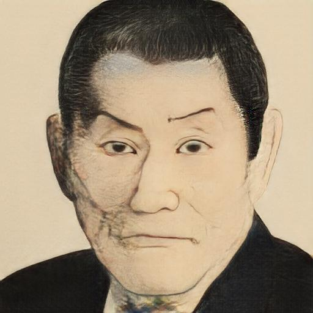
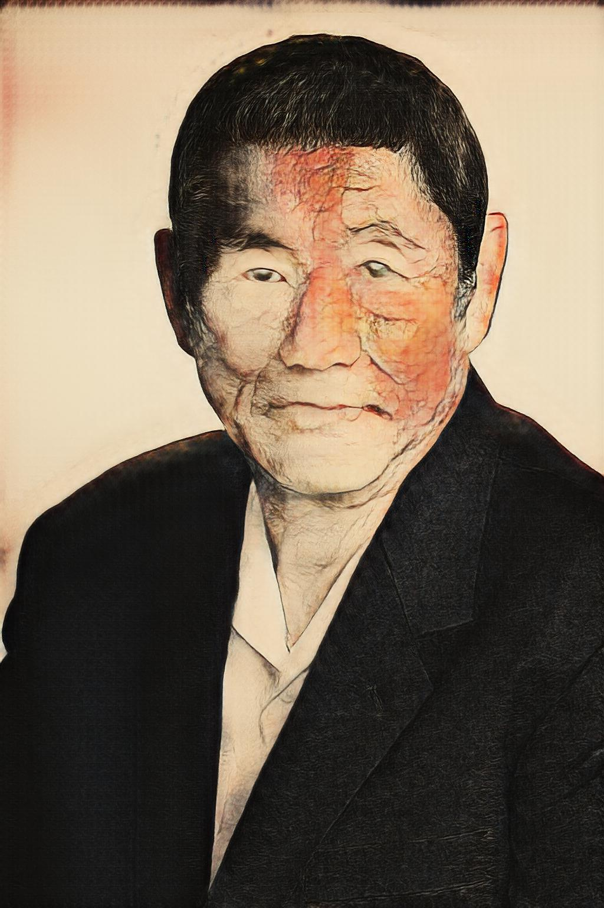

I've spent some time training a StyleGAN2 model on ukiyo-e faces. Here are some results from training and some experimentation with model interpolation.

## Dataset

I've spent some time collecting face images from museum images, suprisingly AWS Rekognition does a reasonable job of detecting faces and landmarks. As most of the images provided by museums are not very high resolution I've also used ESRGAN to upscale to a final 1024x1204 resolution.

Now I've got a few thousand high-resolution and algined ukiyo-e faces ready for StyleGAN training

## Training results

I'm fine tuning from the original FFHQ model (config-e) which has lots of frontal portraits, but these were very uncommon in uikyo-e pictures. The model quickly learns the basic style; then spends a while with a dilemma of how best to turn people's heads; then settles on one side.

Eventually the model basically learns not to have frontal faces and interpolations generally give sharp transitions from left to right looking faces

<video controls src="ukiyoe-interpolation.mp4"></video>

## Ukiyo-e yourself

The early stages of training are interesting in that you often see "ukiyo-e ish" looking faces but with traits of the original. Take a look at this example of the same seed for different iterations in training, in the 2nd panel he's clearly still wearing a suit! 

This early stage of training seems like it might be a promising way of creating a "real" to "ukiyo-e" face model, but at this point the model is already starting to twist the pose of the faces.

### Model interpolation

Playing with well known technique of averaging the weights of the base and the transferred model helps get a bit closer to the original, but the pose is still way off. Here's a few frames of interpolation from the weights of one model to another   

<video controls src="averaging.mp4"></video>

### Layer Swapping

So I've also been playing with something you could call "layer swapping". Taking different resolution layers from the different models and combining them. This helps to avoid changing the pose (which is controlled by early, low resolution layers). Here's an animation as I progressively swap in more layers from the original FFHQ model into the ukiyo-e model.

<video controls src="swapping.mp4"></video>

Swapping in only the lower resolution layers from FFHQ into Ukiyo-e serves to preserve the pose of the generated face, but still transfer the features and style of a typical ukiyo-e portrait. Here's a detail of the point at which I think it looks best.

There are still some artifacts but I think it's a fun technique and sometimes gives some nice results. Here are a bunch more cherry picked examples:

Since this original example I have put a bit more work into testing out these layer swapping ideas. You can get code to do it yourself, and see what other weird and wonderful things myself and others have come up with [[stylegan-network-blending:in this post]].

## Other thoughts

I tried using CycleGAN to iron out the defects in the outputs of the combined model. Training it to convert from the modified model to the original ukiyo-e faces, but the brief attempts I've given haven't got any good results:

While I'm at it, a CycleGAN trained to turn Ukiyo-e faces into real ones does give some pretty amusing results:

<video controls src="ukiyoe_face.mp4"></video>

Currently my "layer swapping" is just a straight copy of the weights of certain layers of one model to the other. But this leads to a harsh transition in the model. Maybe a smoother transition would give nicer results, for example gradual interpolating from one model to the other as you move through the layers.

Another completely different idea would be to simply not train the lower resolution layers to begin. This might prevent the model changing the low resolution appearance (like pose) while getting the appearance of ukiyo-e right

## pix2pixHD model distillation

So one thing to remember is that the people above are _not_ real people, they're generated by the FFHQ trained model. To apply this to a real person's face we'd first have to find their latent representation using an optimisation process (like the projector included in StyleGAN2). To skip out on this laborious step I tried to train a pix2pixHD model (as in the paper [_StyleGAN2 Distillation for Feed-forward Image Manipulation_](https://github.com/EvgenyKashin/stylegan2-distillation)) to "distill" the transformation. This way I can give it an arbitray image of a person and get the ukiyo-e version. The end results aren't too bad

But there are still some interesting failure cases when the input image isn't aligned in the way the training images are.

